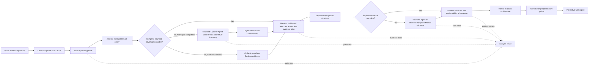

# RepoMentor

> Evidence-driven AI analysis for public GitHub repositories — understand the architecture, follow a reading path, and find a practical way to contribute.

[](https://nodejs.org/)
[](https://www.typescriptlang.org/)

RepoMentor accepts a public GitHub repository and branch, builds a bounded repository profile, selects real source evidence, and produces a structured learning report in three stages. Its public Analysis Trace shows plans, deterministic repository actions, evidence coverage, and runtime decisions in real time without exposing private model reasoning.

## What's new in v0.3.2

- **Bounded Agentic Harness** — larger Anthropic-compatible analyses let Explorer and Mentor choose bounded discovery actions through RepoMentor's in-process MCP tools, while the Harness remains the only source reader.
- **No raw repository permissions** — Agent queries run in isolated temporary directories without `Read`, `Glob`, `Grep`, shell, network, write, or edit tools.
- **Adaptive provider routing** — complete small repositories and OpenAI-compatible providers retain the deterministic Workflow; unsupported Agent capabilities fall back once and are remembered per provider fingerprint.
- **Claude Agent SDK as a first-class runtime** — the SDK is pinned, structured results retain usage and cost metadata, and trusted namespaced Skills are published through the local RepoMentor plugin.
- **Structured output compatibility** — Explorer, Mentor, and Contributor use Draft-07 output schemas with Zod as the final validation boundary, plus text-JSON fallback for compatible endpoints without native support.
- **Accurate analysis traces** — runtime selection, completed discovery actions, evidence reuse, empty tool results, and phase-specific Agent completion are reported without exposing source contents or hidden reasoning.
- **Report polish** — Module Map importance labels now use coordinated colors for `core`, `support`, and `utility`.

## Screenshots

### Start an analysis

<p align="center">
  
</p>

### Follow the analysis in real time

<p align="center">
  
</p>

### Explore the generated report

<p align="center">
  
</p>

### Repository overview and module map

<p align="center">
  
</p>

### Architecture and recommended reading path

<p align="center">
  
</p>

### Contribution opportunities

<p align="center">
  
</p>

## How it works

RepoMentor separates deterministic repository inspection from model reasoning. The model does not repeatedly scan the repository or treat a partial summary as the project itself.



The repository profile includes a bounded file index, hierarchical directory statistics, README and manifest excerpts, engineering configuration, contribution guidance, language statistics, TODO markers, and entry/test candidates. For a small repository whose relevant files fit the active policy, the Harness creates a deterministic complete-coverage plan. Other repositories use a bounded Claude Agent SDK research loop when the provider supports it, with the existing Orchestrator as a capability fallback. OpenAI-compatible providers always use the deterministic Workflow. RepoMentor's provider-neutral Repository Harness validates every tool action and path, applies read budgets, prepares downstream context, and emits a safe operational trace.

The bounded loop is deliberately two-step. The Agent can call only `mcp__repomentor__search_symbols`, `mcp__repomentor__trace_module_dependencies`, and `mcp__repomentor__find_related_tests`; those tools return summaries, paths, and counts—not source. The Agent emits one `EvidencePlan`, then the Harness performs the only source batch read outside the loop. The SDK runs in a fresh temporary `cwd` with `settingSources: []`, no persisted session, and no raw file, shell, network, editing, or delegation tools. A target repository's `CLAUDE.md`, `.claude/skills`, hooks, and agents are therefore evidence only and are never loaded as SDK settings.

| Role | Responsibility |
|---|---|
| **Orchestrator** | Plans small, stage-specific sets of source files when deterministic complete coverage is not available; it does not produce the report itself |
| **Explorer** | Identifies the project type, technology stack, entry points, module boundaries, and repository summary |
| **Mentor** | Explains architecture and dependencies, extracts code patterns, and builds a recommended reading path |
| **Contributor** | Uses contribution docs, TODOs, commit history, tests, and focused source evidence to suggest realistic contribution paths |

Explorer, Mentor, and Contributor receive stage-specific contexts rather than one repeated full prompt. Every stage requests provider-native JSON Schema output and then validates it with Zod; compatible endpoints that do not support native structured output retain the text-JSON parser and one tool-free repair pass.

RepoMentor treats the Harness as the runtime surrounding those models—not as an evaluation suite and not as another Agent. It owns shared state, domain-tool execution, path validation, evidence budgets, stage transitions, tool results, and stop conditions. The current domain tools are deliberately coarse-grained:

| Harness tool | Deterministic responsibility |
|---|---|
| `get_repository_map` | Build the bounded file index, project metadata, entry candidates, and repository overview |
| `search_symbols` | Locate a specific symbol or concept inside a bounded source scan and return candidate evidence paths |
| `trace_module_dependencies` | Resolve repository-internal static dependency edges from known source entry points |
| `find_related_tests` | Locate representative tests from source filenames and directory relationships |
| `read_evidence_batch` | Validate an Orchestrator plan and read one bounded, deduplicated batch of repository evidence |
| `inspect_git_history` | Extract recent themes, frequently touched files, and contributor counts without executing repository code |
| `prepare_contributor_context` | Combine verified evidence with manifests, guidance, tests, and TODO metadata |

The shared `HarnessState` records goals, analysis questions, plans, tool observations, examined and skipped paths, unresolved evidence, active Skill policy, and global usage. A path-keyed Evidence Ledger separately preserves the best known excerpt and its `available`, `partial`, or `missing` state across stages. The Harness executes selected discovery actions, merges discovered paths with direct requests, reads evidence, resolves or records coverage gaps, and stops. Explorer and Mentor can each consume at most one evidence batch; a complete small-repository evidence set can be reused without a second batch. The complete run stops after two batches, 18 file reads, or 88KB of source evidence. These are runtime invariants enforced in code rather than instructions that the model may ignore. Natural-language stop conditions remain visible planning intent; the Harness does not pretend they are machine-verified.

Evidence content is prepared before the stage budget is distributed. If all selected contents fit, they are retained in full regardless of request order; otherwise every candidate receives a bounded baseline before remaining bytes are assigned by priority. Text files use the default bounded reader, while structured container formats can expose normalized text through small, isolated adapters without changing Harness behavior.

Skills are executable Harness capability packs rather than extra Agents. RepoMentor is a trusted local Claude Agent SDK plugin (`.claude-plugin/plugin.json`): each `skills/*/SKILL.md` explains how to use only the RepoMentor discovery tools, while the adjacent `skill.json` remains the authoritative executable policy for allowed tools, questions, evidence requirements, stop intent, and stage limits. Skills are loaded under the `repomentor:<skill-name>` namespace. The Harness—not the prompt or SDK hook—enforces permissions, path provenance, duplicate fingerprints, action/file limits, and stage transitions.

`MENTOR_SUBAGENTS_ENABLED=true` enables an experimental Mentor coordinator with two programmatic SDK `AgentDefinition`s: `architecture-analyst` and `learning-path-reviewer`. Each receives one read-only MCP view containing only evidence already read by the Harness, cannot delegate recursively, and is called exactly once. A third delegation is rejected by a hook. Any incomplete or invalid delegation falls back to the single Mentor synthesis without reading the repository again. This remains off by default until the benchmark gates are met.

## Features

- **Evidence-driven analysis** — conclusions combine a deterministic repository profile with actual selected source files
- **Adaptive complete coverage** — small repositories can skip redundant planning and reuse one complete evidence set across Explorer and Mentor
- **Bounded orchestration** — file selection and batch reads replace uncontrolled tool-call loops
- **Executable Skills** — project-type capability packs guide planning while the Harness enforces their tool and evidence boundaries
- **Evidence Ledger** — path-level read status, monotonic evidence quality, and cross-stage gap resolution are maintained by the runtime
- **Transparent Harness trace** — inspect evidence plans, deterministic repository tools, files examined, coverage budgets, and runtime decisions without exposing chain-of-thought or source contents
- **Real-time progress** — Server-Sent Events stream stage status and detailed logs
- **Structured report** — Overview, Architecture, Reading Path, code conventions, setup instructions, and contribution opportunities
- **Structured coverage boundaries** — missing evidence, test absence, read limits, and deliberate exclusions use stable machine-readable gap types
- **Shared Harness state** — repository coverage, evidence plans, examined paths, unresolved evidence, and global budgets move across stages without relying on growing chat history
- **Repository and analysis caching** — local clones are updated in place; completed reports are cached by repository, branch, commit, and pipeline version
- **Persistent tasks** — SQLite stores task state, completed reports, and compatible analysis experience
- **Reliability controls** — path sandboxing, repository size limits, stage-specific context budgets, timeouts, retry classification, and schema validation
- **Local BYOK model settings** — configure Anthropic-compatible or OpenAI-compatible providers from the web interface
- **Single-process production server** — Fastify serves both the API and the compiled frontend

## Tech stack

| Layer | Technology |
|---|---|
| Agent runtime | RepoMentor provider layer · `@anthropic-ai/claude-agent-sdk` |
| Backend | Node.js · TypeScript · Fastify |
| Validation | Zod |
| Git integration | `simple-git` |
| Storage | `better-sqlite3` |
| Frontend | React · TypeScript · Vite |
| Testing | Vitest · Testing Library |

## Getting started

### Prerequisites

- [Node.js](https://nodejs.org/) 20.19 or newer
- [Git](https://git-scm.com/)
- An API token for an Anthropic-compatible or OpenAI-compatible model endpoint
- A public GitHub repository to analyze

Private repositories are not currently supported.

### Installation

```bash
git clone https://github.com/Freesia2077/RepoMentor.git
cd RepoMentor
npm install
```

Start RepoMentor, open the local web interface, and expand **Model Settings**. Choose a provider protocol, then enter the Base URL, exact model ID, and API key. The key is stored only in the ignored local file `data/model-settings.json` and is never returned by the settings API.

For normal local use, one command is enough after installing dependencies:

```bash
npm start
```

If production assets are missing, RepoMentor builds them automatically, starts the local server, and opens the browser. The source checkout also exposes a `repomentor` executable for `npm link` or a future packaged installation. Useful options are:

```bash
npm start -- --no-open
npm start -- --port 3100
npm start -- --rebuild
```

Two provider protocols are currently available:

| Provider protocol | Runtime | Typical endpoints |
|---|---|---|
| `anthropic-compatible` | Claude Agent SDK | DeepSeek Anthropic endpoint, Anthropic-compatible gateways |
| `openai-compatible` | Chat Completions adapter | OpenAI and compatible `/v1/chat/completions` endpoints |

OpenAI-compatible Base URLs should include the API version prefix when required, for example `https://api.openai.com/v1`.

### Optional environment configuration

The local settings page is recommended, but environment variables remain useful for scripted or reproducible setups:

```env
LLM_PROVIDER=anthropic-compatible
LLM_API_KEY=sk-xxx
LLM_BASE_URL=https://api.deepseek.com/anthropic
LLM_MODEL=deepseek-v4-flash
AGENT_RUNTIME_MODE=adaptive
MENTOR_SUBAGENTS_ENABLED=false
# AGENT_MAX_BUDGET_USD=0.25
```

Existing `ANTHROPIC_AUTH_TOKEN`, `ANTHROPIC_BASE_URL`, and `ANTHROPIC_MODEL` configurations remain backward compatible. Saved web settings take precedence over environment values.

Other available settings include:

```env
PORT=3000
HOST=127.0.0.1
CLONE_TIMEOUT_MS=60000
CLONE_DEPTH=1
MAX_REPO_SIZE_MB=200
TASK_TOTAL_TIMEOUT_MS=600000
INTERACTION_TIMEOUT_MS=15000
MODEL_SETTINGS_PATH=./data/model-settings.json
SQLITE_PATH=./data/repomentor.db
LOG_LEVEL=info
```

`AGENT_RUNTIME_MODE=adaptive` uses complete-coverage Workflow for eligible small repositories, bounded Agent discovery for other Anthropic-compatible runs, and Workflow for OpenAI-compatible runs. `workflow` is the immediate rollback switch. `agentic` requires an Anthropic-compatible provider and returns `invalid_model_settings` otherwise. `AGENT_MAX_BUDGET_USD` is optional; turn, task-timeout, and Harness budgets remain hard limits when it is omitted.

### Development

Start the backend and Vite development server together:

```bash
npm run dev
```

Open [http://localhost:5173](http://localhost:5173). Configure a model once, then enter either a full GitHub URL or the `owner/repository` shorthand and choose a branch.

You can also run each side independently:

```bash
npm run dev:backend   # http://localhost:3000
npm run dev:frontend  # http://localhost:5173
```

### Production

```bash
npm start
```

The production server is available at [http://localhost:3000](http://localhost:3000) unless `HOST`, `PORT`, or their equivalent CLI options are changed. `npm run build` remains available when you want to build without starting.

## Testing

```bash
npm test                  # complete test suite
npm test --workspace=web  # frontend tests
npm run build             # frontend and backend production build
```

## Project structure

```text
RepoMentor/
├── agents/
│   ├── orchestrator/       # stage-specific evidence planning
│   ├── explorer/           # repository structure analysis
│   ├── mentor/             # architecture and learning path
│   └── contributor/        # contribution guidance
├── skills/                 # SKILL.md strategies + executable skill.json Harness policies
├── src/
│   ├── db/                 # SQLite migrations and repositories
│   ├── lib/                # Git, SSE, sandbox, schemas, repository profile, content adapters
│   ├── routes/             # Fastify API and event-stream routes
│   └── services/           # Repository Harness, orchestration, pipeline, and provider integration
├── web/                    # React dashboard
├── tests/                  # backend tests
└── demo/                   # README screenshots
```

## API overview

| Method | Endpoint | Purpose |
|---|---|---|
| `POST` | `/api/analysis` | Create an analysis task from `repoUrl` and optional `branch` |
| `GET` | `/api/analysis/:id` | Read task status or the completed report |
| `POST` | `/api/analysis/:id/ask` | Answer an active interaction question in optional interactive flows |
| `GET` | `/api/analysis/:id/stream` | Subscribe to task events over SSE |
| `GET` | `/api/settings/model` | Read non-secret local model configuration metadata |
| `PUT` | `/api/settings/model` | Save the local provider, endpoint, model, and optional API key |

## Contributing

Contributions are welcome. Before opening a pull request:

1. Create a feature branch from `main`.
2. Run the backend and frontend test suites.
3. Run the production build.
4. For substantial changes, open an issue first so the approach can be discussed.
