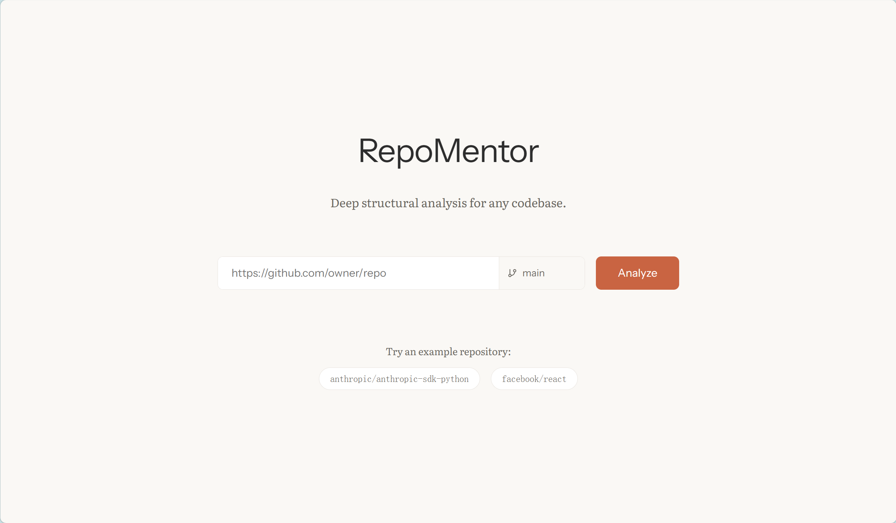
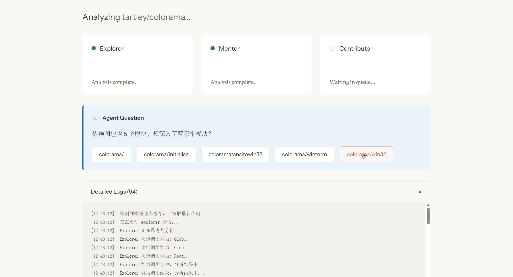
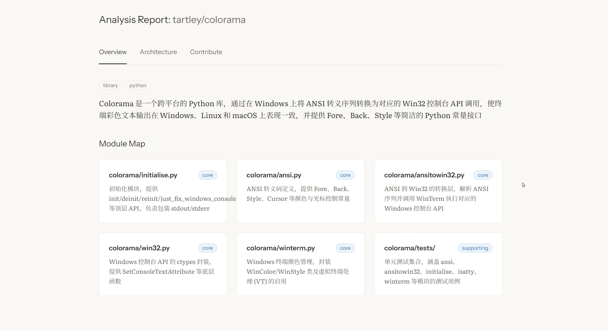

# RepoMentor

> AI-powered repository learning assistant — from "found a repo" to "ready to contribute" in minutes.

[](https://nodejs.org/)

RepoMentor feeds a GitHub repository URL to a three-stage AI agent pipeline and returns a structured analysis report — covering architecture, learning path, and contribution opportunities — streamed to a real-time web dashboard.

<p align="center">
  
  <br />
  <br />
  
  <br />
  <br />
  
</p>

## How it works

Orchestrator manages the analysis lifecycle, handles database persistence, and coordinates the AI pipeline. It sequences the work across three specialized agents:

| Agent | Role |
|---|---|
| **Explorer** | Clones the repository, maps the file tree, identifies tech stack and entry points |
| **Mentor** | Analyzes architecture, traces module dependencies, generates a recommended reading path |
| **Contributor** | Surfaces Good First Issues, explains the contribution workflow, highlights code conventions |

Each stage streams its progress over SSE. The frontend renders results incrementally as agents complete their work.

## Features

- **Multi-provider LLM support** — works with both Anthropic Claude and DeepSeek
- **Real-time streaming** — analysis progress visible as it happens via Server-Sent Events
- **Interactive analysis** — agents can pause and ask clarifying questions mid-run
- **Persistent history** — past analyses stored locally in SQLite, zero external dependencies
- **Single-binary deployment** — Fastify serves both the API and the compiled frontend

## Tech Stack

| Layer | Technology |
|---|---|
| Agent framework | `@anthropic-ai/claude-agent-sdk` |
| Backend | Node.js · TypeScript · Fastify |
| Storage | `better-sqlite3` (local SQLite) |
| Frontend | React · TypeScript · Vite |
| Dev tooling | `concurrently` · Vitest |

## Getting Started

### Prerequisites

- [Node.js](https://nodejs.org/) v20.19+
- [Git](https://git-scm.com/) (used natively for cloning target repositories)

### Installation

```bash
git clone https://github.com/Freesia2077/RepoMentor.git
cd RepoMentor
npm install
```

### Configuration

```bash
cp .env.example .env
```

Open `.env` and set your AI provider API key:

```env
ANTHROPIC_AUTH_TOKEN=your_key_here
# If using DeepSeek, also set:
ANTHROPIC_BASE_URL=https://api.deepseek.com/anthropic
ANTHROPIC_MODEL=deepseek-v4-flash
```

### Development

Start the backend (port 3000) and frontend dev server (port 5173) together:

```bash
npm run dev
```

Open `http://localhost:5173` and enter any public GitHub repository URL.

### Production Build

```bash
npm run build   # compiles frontend into web/dist and transpiles backend
npm start       # serves everything from http://localhost:3000
```

## Project Structure

```
RepoMentor/
├── src/          # Fastify backend — routes, SSE, SQLite integration
├── agents/       # Agent definitions and orchestration logic
├── skills/       # Reusable skill prompts for the agent pipeline
├── web/          # React + Vite frontend
└── tests/        # Backend test suite (Vitest)
```

## Contributing

Contributions are welcome. Before opening a pull request, please:

1. Fork the repository and create a feature branch from `main`
2. Run `npm test` and ensure all tests pass
3. For significant changes, open an issue first to discuss the approach
