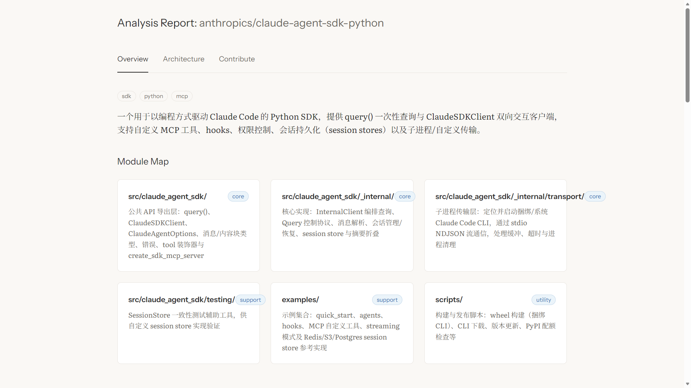
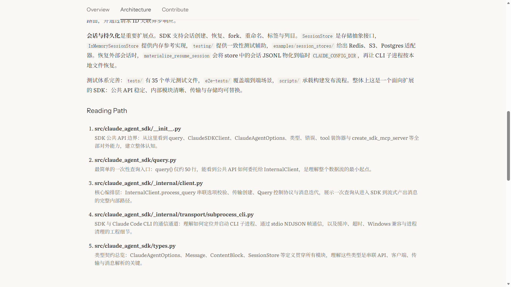
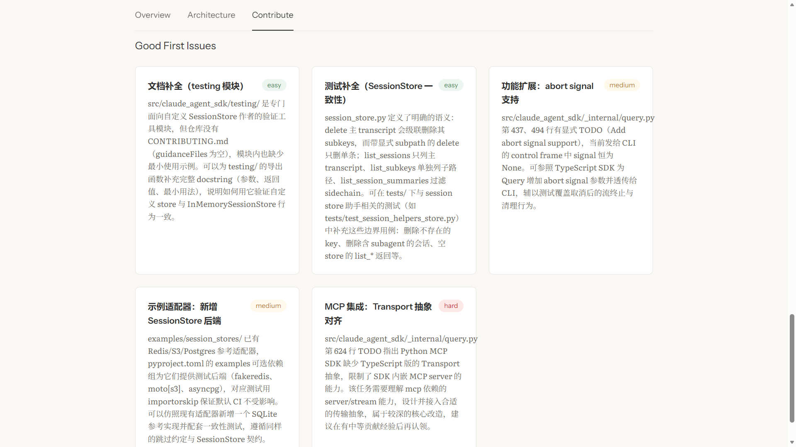

# RepoMentor

> Evidence-driven AI analysis for public GitHub repositories — understand the architecture, follow a reading path, and find a practical way to contribute.

[](https://nodejs.org/)
[](https://www.typescriptlang.org/)

RepoMentor accepts a public GitHub repository and branch, builds a bounded repository profile, selects representative source evidence, and produces a structured learning report in three stages. Progress, interactions, and results are streamed to a React dashboard in real time.

## Screenshots

### Start an analysis

<p align="center">
  
</p>

### Follow the analysis in real time

<p align="center">
  
</p>

### Explore the generated report

<p align="center">
  
</p>

### Repository overview and module map

<p align="center">
  
</p>

### Architecture and recommended reading path

<p align="center">
  
</p>

### Contribution opportunities

<p align="center">
  
</p>

## How it works

RepoMentor separates deterministic repository inspection from model reasoning. The model does not repeatedly scan the repository or treat a partial summary as the project itself.


The repository profile includes a bounded file index, hierarchical directory statistics, README and manifest excerpts, engineering configuration, contribution guidance, language statistics, TODO markers, and entry/test candidates. Orchestrator uses that profile to choose representative files; the backend validates every path and reads them in bounded batches.

| Role | Responsibility |
|---|---|
| **Orchestrator** | Plans small, stage-specific sets of source files to inspect; it does not produce the report itself |
| **Explorer** | Identifies the project type, technology stack, entry points, module boundaries, and repository summary |
| **Mentor** | Explains architecture and dependencies, extracts code patterns, and builds a recommended reading path |
| **Contributor** | Uses contribution docs, TODOs, commit history, tests, and focused source evidence to suggest realistic contribution paths |

Explorer, Mentor, and Contributor receive stage-specific contexts rather than one repeated full prompt. Their outputs are validated with Zod; malformed JSON gets one tool-free repair pass without rescanning the repository.

## Features

- **Evidence-driven analysis** — conclusions combine a deterministic repository profile with actual selected source files
- **Bounded orchestration** — file selection and batch reads replace uncontrolled tool-call loops
- **Real-time progress** — Server-Sent Events stream stage status and detailed logs
- **Interactive checkpoints** — correct the detected project type or choose a module to explore more deeply
- **Structured report** — Overview, Architecture, Reading Path, code conventions, setup instructions, and contribution opportunities
- **Repository and analysis caching** — local clones are updated in place; completed reports are cached by repository, branch, commit, and pipeline version
- **Persistent tasks** — SQLite stores task state, completed reports, and compatible analysis experience
- **Reliability controls** — path sandboxing, repository size limits, stage-specific context budgets, timeouts, retry classification, and schema validation
- **Anthropic-compatible model endpoint** — configured for DeepSeek by default and adaptable to other compatible endpoints
- **Single-process production server** — Fastify serves both the API and the compiled frontend

## Tech stack

| Layer | Technology |
|---|---|
| Agent runtime | `@anthropic-ai/claude-agent-sdk` |
| Backend | Node.js · TypeScript · Fastify |
| Validation | Zod |
| Git integration | `simple-git` |
| Storage | `better-sqlite3` |
| Frontend | React · TypeScript · Vite |
| Testing | Vitest · Testing Library |

## Getting started

### Prerequisites

- [Node.js](https://nodejs.org/) 20.19 or newer
- [Git](https://git-scm.com/)
- An API token for an Anthropic-compatible model endpoint
- A public GitHub repository to analyze

Private repositories are not currently supported.

### Installation

```bash
git clone https://github.com/Freesia2077/RepoMentor.git
cd RepoMentor
npm install
```

Copy `.env.example` to `.env`, then configure the model endpoint:

```env
ANTHROPIC_AUTH_TOKEN=sk-xxx
ANTHROPIC_BASE_URL=https://api.deepseek.com/anthropic
ANTHROPIC_MODEL=deepseek-v4-flash
```

Other available settings include:

```env
PORT=3000
HOST=127.0.0.1
CLONE_TIMEOUT_MS=60000
CLONE_DEPTH=10
MAX_REPO_SIZE_MB=200
TASK_TOTAL_TIMEOUT_MS=600000
INTERACTION_TIMEOUT_MS=30000
SQLITE_PATH=./data/repomentor.db
LOG_LEVEL=info
```

### Development

Start the backend and Vite development server together:

```bash
npm run dev
```

Open [http://localhost:5173](http://localhost:5173). Enter either a full GitHub URL or the `owner/repository` shorthand, then choose a branch.

You can also run each side independently:

```bash
npm run dev:backend   # http://localhost:3000
npm run dev:frontend  # http://localhost:5173
```

### Production

```bash
npm run build
npm start
```

The production server is available at [http://localhost:3000](http://localhost:3000) unless `HOST` or `PORT` is changed.

## Testing

```bash
npm test                  # backend tests
npm test --workspace=web  # frontend tests
npm run build             # frontend and backend production build
```

## Project structure

```text
RepoMentor/
├── agents/
│   ├── orchestrator/       # stage-specific evidence planning
│   ├── explorer/           # repository structure analysis
│   ├── mentor/             # architecture and learning path
│   └── contributor/        # contribution guidance
├── skills/                 # project-type analysis strategies
├── src/
│   ├── db/                 # SQLite migrations and repositories
│   ├── lib/                # Git, SSE, sandbox, schemas, repository profile
│   ├── routes/             # Fastify API and event-stream routes
│   └── services/           # orchestration, pipeline, and model integration
├── web/                    # React dashboard
├── tests/                  # backend tests
└── demo/                   # README screenshots
```

## API overview

| Method | Endpoint | Purpose |
|---|---|---|
| `POST` | `/api/analysis` | Create an analysis task from `repoUrl` and optional `branch` |
| `GET` | `/api/analysis/:id` | Read task status or the completed report |
| `POST` | `/api/analysis/:id/ask` | Answer an active interaction question |
| `GET` | `/api/analysis/:id/stream` | Subscribe to task events over SSE |

## Contributing

Contributions are welcome. Before opening a pull request:

1. Create a feature branch from `main`.
2. Run the backend and frontend test suites.
3. Run the production build.
4. For substantial changes, open an issue first so the approach can be discussed.
